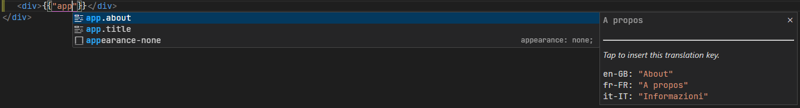
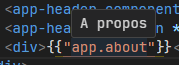

# Internationalization (i18n) Assistant for VS Code

Streamline your internationalization process with the Internationalization (i18n) Assistant, a powerful extension designed to enhance productivity by providing real-time translation updates, intuitive key autocompletion and on-hover translation displays.

## Features

### Live Translation Updates

Automatically refresh translations as you work, ensuring your project is always up-to-date with the latest changes.

### Key Autocompletion

Receive intelligent suggestions for translation keys as you type, making it faster and easier to work with your i18n files.



### Hover to View Translations

Quickly view the value of translation keys by simply hovering over them, saving time and improving workflow efficiency.



## How to Use

After adding the extension to your Visual Studio Code setup, it automatically activates for projects with a specified root directory for translations. Here's how to make the most of its features:

-   **Live Translation Updates**: Simply work as you normally would. The extension monitors changes to your translation files and updates them in real time.
-   **Key Autocompletion**: Start typing a translation key within your code to see suggestions based on existing keys.
-   **Hover to View Translations**: Move your cursor over a translation key to view its current value in a small popup.

## Configuration

Customize the extension to fit your workflow by setting your project's root translation directory in `settings.json`:

-   **`i18n-helper.i18nFolderUri`**: Specifies the path to the folder containing your i18n files. This should be set relative to the root of your project.

-   **`i18n-helper.mainLanguage`**: Defines the main language of your application. This is useful for determining the primary language file to reference for translations and defaults. set it to match the name of your file. For example if you have a file named `en-US.json` set this to `en-US`, for `en.json` set this to `en`.

-   **`i18n-helper.displayLoadingMeesage`**: Enables or disables the display of loading messages when the extension is fetching translations. This can be set to `true` to show messages, which can be helpful for debugging or understanding the extension's activity, or `false` to hide these messages for a cleaner interface.

### Example Configuration

```json
{
    "i18n-helper.i18nFolderUri": "/src/assets/i18n",
    "i18n-helper.mainLanguage": "fr-FR",
    "i18n-helper.displayLoadingMeesage": true
}
```
